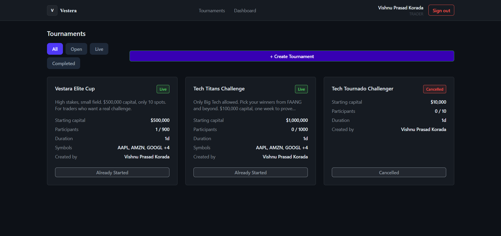
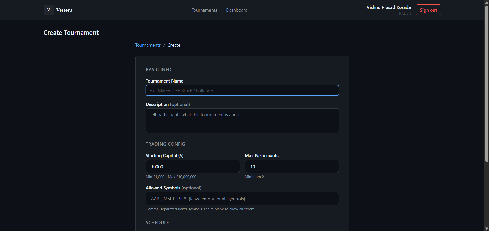
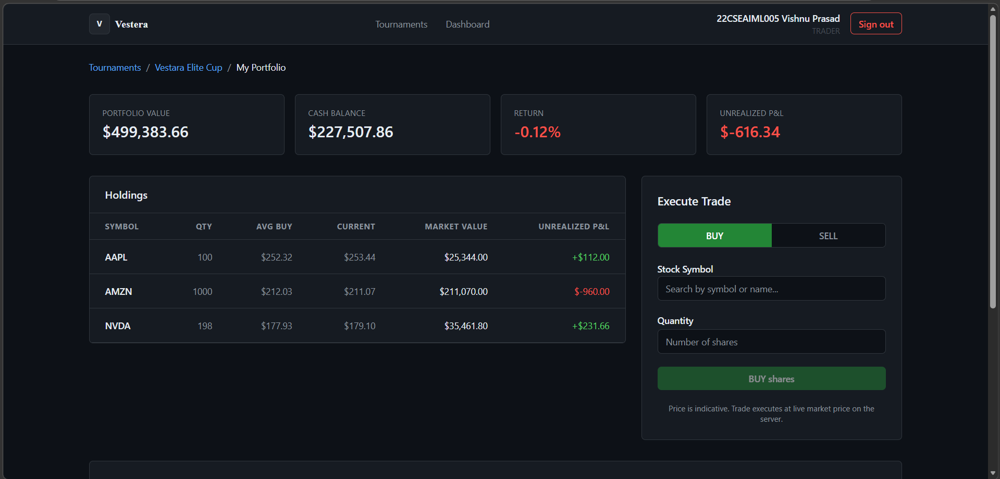
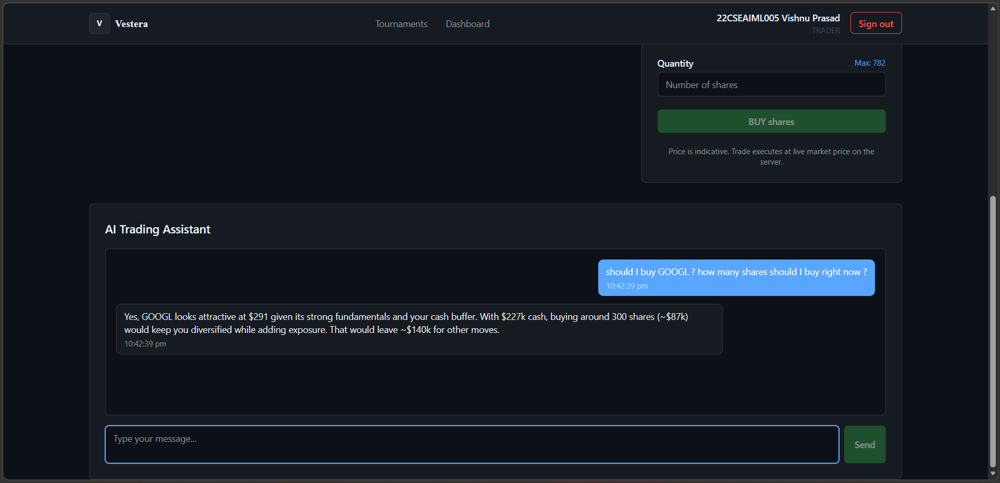

# Vestara — Paper Trading Tournament Platform

A competitive paper trading platform where participants trade
real-time NYSE stocks in time-bound tournaments without financial risk.

## Features
- Tournament lifecycle management (create, join, trade, leaderboard)
- Real-time market data via Finnhub with circuit breaker fault tolerance
- AI trading assistant powered by Open AI (OpenRouter API) — context-aware advice
  based on live portfolio state
- JWT authentication + GitHub OAuth2 SSO
- Granular RBAC (4 roles, 15+ authorities)
- Idempotent trade execution with optimistic locking

## Tech Stack
Backend: Java 21, Spring Boot 3.5, Spring Security, Hibernate JPA, PostgresDB
Frontend: React 19, TypeScript, TanStack Query, Tailwind CSS  
AI Agent: Spring AI with Openrouter API
Infrastructure: Resilience4j, Caffeine Cache

## Screenshots

